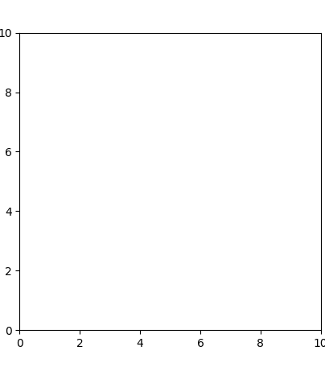

# Pure Pursuit Algorithm


## Demonstration



This simulation generates a smooth Pure Pursuit algorithm on a set of given points. Initially created so that I could experiment with the algorithm for later implementation in my Robotics team.


## Usage

```
python main.py
```


Left-click on the graph to add points. These points will not show up but they are being added to the entry set.

Right-click to create a smooth graph with all the currently selected points.